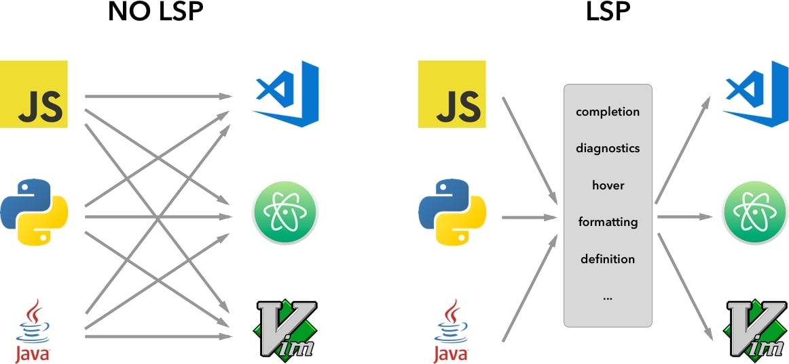

[](https://github.com/david-hass/lsp-introduction/blob/main/README.md)
[](https://github.com/david-hass/lsp-introduction/blob/main/README.de.md)

## Vorwort

Eine exemplarische Implementierung des Language Server Protocols (LSP) in **Go**.  
Dieses Projekt demonstriert die Funktionsweise moderner IDE-Features, indem ein eigener Language Server für eine eigene Domain Specific Language, genannt **Flow**, entwickelt wurde.  
Die Implementierung nutzt einen per Tree-sitter generierten Parser. Glücklicherweise erzeugt Tree-sitter neben dem Parser auch zugehörige Bindings für diverse Sprachen, darunter auch Go.  
Zudem wurde das Go-Package github.com/tree-sitter/go-tree-sitter genutzt, welches eine Reihe von Funktionalitäten zur Verwendung eines solchen Parsers bietet.

Auf weitere Abhängigkeiten, beispielsweise vorgefertigte Implementierungen des Protokolls oder Ähnliches wurde bewusst verzichtet, da das Ziel dieses Projekts das Verstehen des LSPs ist und Abstraktionen fremder Bibliotheken daher kontraproduktiv wirken.

Zunächst werden ein paar grundlegende Begrifflichkeiten erklärt:


### Language Server
Ein Language Server ist zuständig für verschiedene sprachspezifische Funktionen (code intelligence tools) und arbeitet unabhängig vom Editor. 
Eine Reihe gängiger Aufgaben, die ein Language Server erfüllt, sind:
- Codevervollständigung (IntelliSense): Schlägt während der Eingabe passende Code-Elemente vor.
- Fehler- und Warnungsdiagnose: Markiert Fehler und potenzielle Probleme direkt im Code.
- Code-Navigation: Hilft beim Auffinden von Definitionen und Verweisen auf Symbole.
- Formatierung: Formatiert den Code automatisch nach bestimmten Regeln

Der Client ist der Editor selbst. Beim Öffnen oder Bearbeiten einer Datei oder bei anderen bestimmten Benutzerinteraktionen sendet der Client Nachrichten, welche den Language Server über die Ereignisse informiert und ihm ermöglicht, entsprechend zu reagieren.


### Zweck des LSP
Das Language Server Protocol (LSP) dient dazu, die Kommunikation zwischen einem Texteditor oder einer IDE, als Client fungierend, und einem Language Server zu standardisieren. Dadurch kann ein einziger Language Server für eine Programmiersprache entwickelt werden, welcher dann von vielen verschiedenen Editoren genutzt werden kann, die das LSP implementieren.
Diese Standardisierung löst das „M-mal-N-Problem“, bei dem für jede Kombination aus Editor und Sprache eine spezielle Lösung entwickelt werden musste. Des Weiteren entkoppelt es alle sprachanalytischen Aufgaben von der Benutzeroberfläche des Editors.


*https://code.visualstudio.com/assets/api/language-extensions/language-server-extension-guide/lsp-languages-editors.png*


### Go für die Language Server Entwicklung
Language Server werden oft on demand von Editoren gestartet oder mehrfach parallel betrieben. Go-Programme starten extrem schnell, brauchen (i.d.R.) wenig RAM und haben einen geringen CPU-Footprint.
Außerdem ist Cross-Compilation out of the box geboten und das einzelne statisch gelinktes Binary vereinfacht die Distribution maßgeblich.


### Tree-sitter
Tree-sitter setzt sich aus zwei Hauptkomponenten zusammen: Zum einen der Parsergenerator und zum anderen eine inkrementelle Parsing-Bibliothek, die [Syntaxbäume](https://en.wikipedia.org/wiki/Parse_tree) für Quellcode erstellt und diese bei Änderungen effizient aktualisiert. Es ermöglicht Programmen, wie zum Beispiel Editoren oder Language Servern, den Code nicht nur zeilenweise zu analysieren, sondern eine strukturierte, baumartige Darstellung zu erhalten und diese mittels sogenannten Tree-sitter-Queries abzufragen.
Natives inkrementelles Parsing ermöglicht es, bei kleinen Quellcodeänderungen den Syntaxbaum effizient zu aktualisieren, anstatt ihn von neuem aufzubauen. Tree-sitter kann zudem vorübergehend fehlerhaften Code parsen, indem Fehler isoliert werden, sodass der Rest der Datei korrekt verarbeitet und dargestellt wird.


## Projektumsetzung

### **Projektstruktur**
```
.  
├── grammar/    # Die Tree-sitter Grammatik  
├── server/     # Der Language Server (Go)  
├── vscode/     # Der VS Code Client (TypeScript Extension)  
└── examples/   # Beispiel-Dateien (.flow)
```


### **FlowLang**

FlowLang ist eine minimale (Proof-of-Concept) DSL zur Definition von Daten-Pipelines. Die einzelnen Bestandteile einer üblichen Flow-Datei sind die folgenden:

Die Sprache erlaubt zu definieren, woher die Daten stammen (source):  
```hcl
source "raw_user_data" {  
    path: "/data/users.csv"  
    encoding: "utf-8"  
}
```

welche Arten von Verarbeitung auf diese Daten angewandt werden (task): 
```hcl
task "filter_active_users" {  
    # Nimmt Output von "raw_user_data" als Input  
    input: raw_user_data  
    transformer: "filter_by_column 'status' == 'active'"  
}
```

und wohin die Daten transportiert werden (sink):  
```hcl
sink "active_user_report" {  
    # Nimmt den Output des filter_active_users Tasks  
    input: filter_active_users  
    path: "/reports/active_users.json"  
}
```

Die Grammatik ist bewusst einfach gehalten; auf explizite Präzedenzregeln oder komplexe Konfliktlösungen (Ambiguitäten) wurde verzichtet.  
Der Server analysiert den vom Tree-sitter-Parser erzeugten CST (Concrete Syntax Tree) und stellt Editoren über das LSP verschiedene Features bereit.


### Die Grammatik (EBNF)

```
source_file       ::= { definition }

definition        ::= source_definition | task_definition | sink_definition

source_definition ::= "source" string_literal source_body
source_body       ::= "{" { prop_path | key_value_pair } "}"

task_definition   ::= "task" string_literal task_body
task_body         ::= "{" { prop_input | prop_transformer | key_value_pair } "}"

sink_definition   ::= "sink" string_literal sink_body
sink_body         ::= "{" { prop_input | prop_path | key_value_pair } "}"

prop_path         ::= "path" ":" string_literal
prop_input        ::= "input" ":" identifier
prop_transformer  ::= "transformer" ":" string_literal

key_value_pair    ::= identifier ":" value
value             ::= string_literal | identifier | number | boolean
```


### **Implementierte Features**

1. [Contextual Hover](https://github.com/david-hass/lsp-introduction/blob/main/server/hover.go) (textDocument/hover)  
   Wenn der Mauszeiger über Schlüsselwörter wie sink, task usw. bewegt wird, erhält der Nutzer textuelle Informationen zur Syntax.
   Der Language Server ermittelt über die Cursorposition, welches Node im Syntaxbaum betroffen ist und über dessen Typ, welche Textinformationen an den Client geliefert werden müssen.
2. [Semantische Diagnose](https://github.com/david-hass/lsp-introduction/blob/main/server/diagnostics.go) (textDocument/publishDiagnostics)  
   Der Server prüft logische Referenzen. Wenn zum Beispiel ein task als input verwendet wird, der nicht definiert wurde, wird dies als Fehler markiert.
   Beim Öffnen oder Ändern eines Dokuments, sammelt der Language Server zuerst die Definitionen, dann die Referenzierungen und gleicht diese im Anschluss miteinander ab.


### **Build & Installation**

Das Projekt wurde unter folgender Umgebung entwickelt:

* Linux (Manjaro 6.16)  
* Go 1.25.1  
* npm 11.6.1  
* gcc 15.2.1


1. #### Grammatik generieren (Optional)

    Der C-Code des Parsers liegt bereits in server/parser/. Falls Änderungen an der Grammatik (grammar/grammar.js) vorgenommen werden, muss sie neu generiert werden:  
    ```
    cd grammar  
    npm install  
    npx tree-sitter generate && npx tree-sitter build  
    ```
    Danach müssen die Dateien manuell nach ../server/parser/ kopiert werden  
    Alternativ das Skript nutzen: ../server/copyparser.sh


2. #### Server bauen

    Der Server muss kompiliert werden, damit die Clients ihn starten können.  
    ```
    cd server  
    go mod tidy  
    CGO_ENABLED=1 go build -o flow-lsp
    ```
    
    **Test:** Führe ./flow-lsp aus. Der Server sollte starten und auf Input warten. Außerdem sollte eine Logdatei unter /tmp/flow\_lsp.log (unter Windows meist %TEMP%\\flow\_lsp.log) mit folgendem Inhalt erstellt worden sein:  
    ```
    2025/11/27 12:29:21 --- flowlang server started ---
    2025/11/27 12:29:21 tree sitter parser loaded.
    2025/11/27 12:29:21 flow tree sitter parser loaded
    ```


### **Integration in Neovim**

Folgendermaßen könnte die Integration unter Verwendung von lazy.nvim / nvim-lspconfig stattfinden.  
In der mason-lspconfig config() folgendes einfügen und ggf. anpassen:  
```
local flow_lsp_path = vim.fn.expand("~/projects/lsp-introduction/server/flow-lsp")
local util = require 'lspconfig.util'

vim.lsp.config.flow = {
  cmd = { flow_lsp_path },
  filetypes = { "flow" },
  root_dir = util.find_git_ancestor() or util.path.dirname,
  capabilities = capabilities,
}
vim.lsp.enable('flow')
```
Bei Problemen verweise ich auf: ``:h lsp-config``


### **Integration in VS Code**

Der VS Code Client befindet sich im Ordner vscode/.  
**Abhängigkeiten installieren:**  
cd vscode  
npm install

1. Führe in VS Code den Befehl: Developer: Install Extension from Location... aus.  
2. Wähle dann den Ordner vscode aus diesem Repository.  
3. Öffne nun die VS Code Einstellungen und suche nach "flow".  
4. Trage bei **Flow: Server Path** den absoluten Pfad zu deiner flow-lsp Binary ein.


### **Referenzen**

* [LSP Specification](https://microsoft.github.io/language-server-protocol/)  
* [Tree-sitter](https://tree-sitter.github.io/tree-sitter/)  
* [go-tree-sitter Bindings](https://github.com/tree-sitter/go-tree-sitter)
